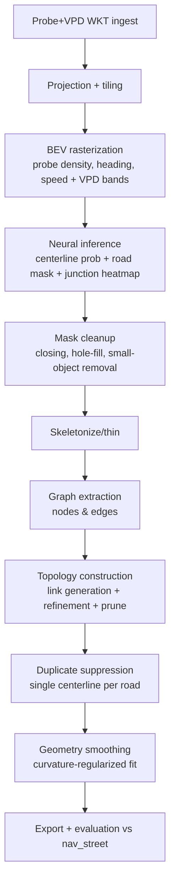

# SOTA Road Centerline Generation and Geometry Filtering from Probe + VPD

## Task definition in the updated competition docs and what is unknown

The updated hackathon spec defines two tasks. **Problem 1** is to “convert raw probe traces and/or VPD detections into smooth, continuous, and topologically correct road centerlines suitable for ingestion into a road network,” emphasizing intersections and continuity. **Problem 2** is **“Road Geometry Filtering & Classification”**: classify detected road geometries and decide whether they should be ingested into the road network using probe/VPD signals (density, directionality, temporal consistency) and minimizing false positives; suggested example classes include “Public navigable roads,” “Restricted or residential roads,” and “Parking entrances, service roads.” (From the uploaded `competition-description.md`.)

Data characteristics in the updated docs matter for SOTA method selection: **VPD** is vehicle-only, more structured, delivered as **WKT LINESTRING** in **WGS84 (EPSG:4326)**, and the competition uses **Fused True** drives; it includes attributes such as **altitudes**, crosswalk types, traffic signal count, construction percent, etc. (From the uploaded `competition-description.md`.) These complement **probe**, which is noisier and heterogeneous. (From the uploaded `competition-description.md`.)

Ground truth and evaluation: you asked to use **nav_street** as the ground-truth reference for scoring; the uploaded nav_street attribute reference indicates ground truth contains link IDs, endpoints, direction, functional class, speed limits, and **z-level** fields (ref/nref) intended to represent relative vertical position when features do not meet at grade. (From the uploaded `nav_street_attributes_explained.md`.)

Unspecified details that materially affect “benchmark-grade” rigor are not present in the updated doc: (i) exact training/validation/test splits, (ii) region extents / tiling scheme, (iii) target output format (graph schema, snapping tolerances), and (iv) official evaluation metrics and thresholds (buffer radius, graph matching method). Where the literature relies on explicit radii/thresholds, this report marks them as **hyperparameters to be reported and tuned**.

## SOTA methods for Problem 1 that beat Kharita-class baselines and are positioned to beat Roadster in practice

### Baselines you cited: what they optimize and why recall is often low

**Kharita (Stanojević et al., 2017)** is a strong algorithmic map inference baseline: it clusters GPS points, builds a directed weighted graph, and then sparsifies using **graph spanners**; it uses angle and speed information and includes an online variant. citeturn38view0turn38view4turn38view5 Kharita reports improvements up to **“f-score of up to 20%”** (Sec. 5) and presents execution-time comparisons showing some competing baselines are expensive; it discusses scalability by slicing data windows and measuring runtime and GEO/TOPO F-scores. citeturn38view3turn38view4

**Roadster (Buchin et al., Computers & Geosciences, Feb 2025)** is an open-access, computational-geometry-forward system that builds maps by **subtrajectory clustering** using fast Fréchet-based clustering, representative-path extraction, geometric refinement, and improved intersection placement; it claims a detailed evaluation and that results outperform prior methods in global and local evaluations. citeturn25view0turn0search1 Roadster’s code is public. citeturn3view2  
Because Roadster’s PDF could not be reliably fetched in this session (timeouts on an open repository mirror), this report does **not** quote Roadster’s numeric tables and instead treats Roadster as a high-quality algorithmic baseline whose *failure modes in your setting* are likely to be: missing low-coverage roads and conservative cluster-selection thresholds (i.e., recall loss), especially when probe density is uneven.

### SOTA trajectory→map deep learning: DeepMG (AAAI 2020) as the strongest “published benchmark” upgrade over Kharita

**DeepMG: “Learning to Generate Maps from Trajectories” (Ruan et al., AAAI 2020)** is the most directly relevant peer-reviewed SOTA for “centerline generation from trajectories” with explicit baseline comparisons including **Kharita**. DeepMG has two modules: (i) **geometry translation** with **T2RNet** and (ii) **topology construction** via trajectory-informed “link + prune.” citeturn34view0turn34view5turn2search13

**Published benchmark results (beats Kharita tested in-paper):**
DeepMG reports that across spatial resolutions on two real-world taxi trajectory datasets, it “consistently outperforms” baselines; at the finest resolution it improves over the best baseline by **32.3% on TaxiBJ** and **6.5% on TaxiJN**. citeturn34view3turn34view5 These baselines include **Kharita** (explicitly shown in their visual comparison lineup). citeturn34view5

**Architecture (what matters for your competition):**
DeepMG recombines two complementary raster “views” of trajectories—**spatial view** and **transition view**—and uses a CNN to infer centerlines; then it performs topology repair using trajectories as transition evidence. citeturn2search13turn34view0turn34view5 This is exactly aligned with your need to lift recall while preserving routability.

**Compute/size (published):**
DeepMG reports that the **T2RNet** model is trained with **one NVIDIA Tesla V100**, using Adam with learning rate **2e-4**, batch size **8**, with learning rate halved every 10 epochs. citeturn34view2turn34view3 It also reports parameter counts for multiple candidate segmentation backbones and shows that **T2RNet has 63.0M parameters** (larger than UNet 39.4M, D-LinkNet 31.1M, LinkNet 21.7M in their table). citeturn34view5

### A newer deep raster approach: RING-Net (ACM BigSpatial@SIGSPATIAL 2022)

**RING-Net (Eftelioglu et al., BigSpatial 2022)** is highly relevant to your probe+VPD setting because it explicitly frames road inference from GPS trajectories as **image segmentation** and provides (i) a rich **multi-band rasterization** and (ii) topology-aware evaluation and loss.

**Architecture and training strategy:**
RING-Net is based on **D-LinkNet** (an encoder–decoder with dilated convolutions) adapted to accept many input channels, with an added **spatial self-attention** layer to learn global context. citeturn35view4 It rasterizes trajectories into **12 bands** that include traversal count, average speed, bearing change, acceleration, and directional histograms (8 compass directions). citeturn35view0 It uses OSM roads as ground truth for segmentation in the paper; conceptually you would substitute **nav_street** as the ground truth in the hackathon. citeturn37view2

**Loss function for connectivity (important for topology scoring):**
RING-Net uses a weighted combination of classic Dice loss and a **centerline-based Dice loss** computed over skeletons rather than masks, motivated by the need for linearity/connectivity over polygon IoU. citeturn35view3turn35view4 This is directly applicable to producing a single connected skeleton suitable for centerline vectorization.

**Metrics & benchmark results (published in-paper):**
RING-Net evaluates using a “Topo” metric and introduces **I-Topo**, which creates holes at intersections to penalize connectivity breaks more heavily and better reflect routability at junctions. citeturn35view2 In its Rome Taxi Trajectory dataset analysis, it reports average **Topo precision 0.92 / recall 0.31** at an 8 m radius, and for the same radius **I-Topo precision 0.30 / recall 0.12**, explicitly attributing low recall largely to incomplete GPS coverage. citeturn35view0turn35view2

**Post-processing details (published):**
RING-Net describes a concrete stitching and cleanup pipeline: splitting into large tiles and subtiles (1024×1024), stitching outputs, smoothing masks via **morphological closing with a 5-pixel square**, removing objects smaller than **100 pixels**, closing holes, skeletonizing, extracting a graph using an image-skeleton graph extractor (SKNW), and using ~**100-pixel overlap** between adjacent tiles to preserve border connectivity. citeturn35view2

### Hybrid topology-first learning: COLTRANE (ACM BuildSys 2019)

**COLTRANE (Prabowo et al., BuildSys 2019)** is a hybrid SOTA-style framework: it uses an Iterated Trajectory Mean Shift (ITMS) module to localize centerlines from noisy points and a CNN trained on a trajectory descriptor to detect/classify junctions for refinement. citeturn11search2turn11search6 It reports **up to 37% improvement in F1** over existing methods on two real-world datasets (city roads, airport tarmac), showing value in explicitly learning junction behavior rather than relying on density clustering alone. citeturn11search2turn11search6

### High-precision graph building + merge-for-recall: RoadRunner (SIGSPATIAL 2018)

RoadRunner (He et al., SIGSPATIAL 2018) is practically important for your “high precision but low recall baseline” issue: it incrementally follows trajectory flow using trajectory connectivity to distinguish overlapping/parallel roads and infer connectivity; then it merges roads inferred by other methods to improve recall without sacrificing precision. citeturn24view0turn22search6 On the official MAPSTER project page, they report evaluation in four U.S. cities using 60,000 trajectories: precision improves by **5.2 points (33.6%)** and **24.3 points (60.7%)** over two existing schemes, with a slight recall increase. citeturn24view0

For implementation and operational scaling, the RoadRunner GitHub repo describes building a GPS trace index server for datasets in the 10–100+GB range and exposes tunable parameters like minimal trips per branch, history length, etc., explicitly noting precision/recall tradeoffs. citeturn18view0

### Comparison table for Problem 1 candidates

| Method | Core architecture / algorithm | Inputs (as published) | Published benchmarks & results | Why it’s a credible path to outperform Kharita/Roadster | Params / compute signals | Pros | Cons / risks |
|---|---|---|---|---|---|---|---|
| **DeepMG (AAAI 2020)** citeturn34view0turn34view5 | Raster features (spatial + transition views) → **T2RNet CNN** centerline inference + **trajectory-based topology construction (link+prune)** | GPS trajectories; OSM GT | Improves over best baseline by **+32.3% F1 (TaxiBJ)** and **+6.5% (TaxiJN)**; includes Kharita among baselines citeturn34view3turn34view5 | Directly demonstrated to outperform Kharita-class baselines; topology stage targets connectivity (often the recall killer) citeturn34view5 | **T2RNet 63.0M params**; trained on **1× Tesla V100**, batch=8, lr=2e-4 citeturn34view2turn34view3turn34view5 | Strong recall for low sampling rates; explicit topology repair | Needs careful rasterization resolution; requires post-processing to avoid skeleton artifacts |
| **RING-Net (BigSpatial 2022)** citeturn35view4 | Multi-band trajectory raster (12 bands) → modified **D-LinkNet + attention** segmentation; **centerline Dice** | GPS trajectories; OSM GT | Avg **Topo P=0.92, R=0.31** at 8 m; proposes **I-Topo** for intersections citeturn35view2turn35view0 | Designed for completeness improvements and explicitly optimizes connectivity via centerline loss; useful as a high-precision “proposal + connect” stage | No params given; backbone is D-LinkNet-like; expect ~30M–40M params (analytic estimate; D-LinkNet in DeepMG table is 31.1M) citeturn34view5turn35view4 | Rich feature encoding that matches probe+VPD (speed, direction, turns); explicit intersection metric | Published recall is low when coverage sparse; needs VPD/probe fusion and topology stage to raise recall |
| **RoadRunner (SIGSPATIAL 2018)** citeturn24view0turn18view0 | Incremental graph growth following trajectories (high precision) + merge with other schemes (recall recovery) | GPS trajectories (+ optional imagery method merge) | Precision improves by 5.2 and 24.3 points over two schemes; recall slightly increases citeturn24view0 | A blueprint for “precision core + recall merge,” ideal when public baselines miss roads | Algorithmic (no params); runtime depends on trajectory indexing and region size | Excels in complex topology & parallel roads; designed for merging | Not itself a high-recall method; must pair with high-recall proposal generator |
| **COLTRANE (BuildSys 2019)** citeturn11search2turn11search6 | ITMS centerline localization + CNN junction detection/classification | GPS trajectories | Up to **37% F1 improvement** over existing methods on two datasets citeturn11search2turn11search6 | Strong junction modeling can increase connectedness and recall at intersections (common failure mode) | Hybrid; CNN size not reported | Robustness across unusual environments | Not directly benchmarked vs Roadster; requires careful integration with graph-building stage |
| **Kharita (2017)** citeturn38view0turn38view4 | Clustering → directed graph → **spanner sparsification**; online variant | GPS trajectories | Reports up to **20% f-score** improvement; reports execution-time evaluation and scalability analysis citeturn38view3turn38view4 | Baseline to beat | Algorithmic (no params); runtime scales with points/clusters/spanner | Simple, reproducible, fast | Tends to under-represent low-support roads when thresholds + sparsification prune (recall loss) |
| **Roadster (2025)** citeturn25view0turn3view2 | **Fréchet subtrajectory clustering** → representative paths → refinement + improved intersection placement | GPS trajectories | Claims outperformance in global/local eval; full numeric tables not extracted here due to PDF timeouts citeturn25view0turn0search1 | Strong algorithmic baseline; likely high precision | Algorithmic (no params); complexity cluster-driven | Excellent geometric refinement | Can be conservative on rare/low-coverage roads unless tuned for recall; direct numeric comparison not cited here (unavailable) |

## SOTA methods for Problem 2: road-geometry filtering and classification using probe + VPD

Problem 2 is not “attribute inference” in the RoadTagger sense in the updated doc; it is **ingestion filtering / classification** of candidate geometries. Still, the strongest transferable SOTA pattern for your **probe+VPD → road class** setting is: **local feature extraction → graph-aware context propagation → calibrated classification**.

### Graph-contextual attribute inference template: RoadTagger (AAAI 2020) and how to adapt it

**RoadTagger (He et al., AAAI 2020)** is a peer-reviewed, benchmarked architecture that combines **CNN local features + GNN propagation** to overcome the limited effective receptive field of local classifiers, improving inference of lane count and road type. citeturn36view1turn36view2

Key evidence (published):
RoadTagger improves lane-count accuracy **71.8% → 77.2%** and road-type accuracy **89.1% → 93.1%**, reducing absolute lane error by **22.2%**, compared to a CNN-only baseline; it also reports comparisons to MRF post-processing baselines. citeturn36view1turn36view2

Compute/training details (published):
RoadTagger is trained on a **V100 GPU for 300k iterations**; it uses graph Laplacian regularization weight 3.0 and propagation steps 8. citeturn36view3turn36view2

How to adapt to Problem 2:
Replace “satellite image tile CNN” with a **probe+VPD feature encoder**:
1. Build a candidate segment graph (from Problem 1 output).
2. Compute per-segment and per-node embeddings from VPD/probe statistics (density, heading entropy, speed quantiles, temporal stability, VPD quality scores, construction percent, traffic signal counts, crosswalk types, altitude profile smoothness).
3. Run a GNN (GraphSAGE/GAT/GraphTransformer) to propagate “road-likeness and class” evidence along connected structure, analogous to RoadTagger’s message passing logic. citeturn36view1turn36view2

### Probe-only sequence classification evidence: road type classification from speed profiles

A recent open-access example showing strong classification performance from motion signals is **“Road Type Classification of Driving Data Using Neural Networks” (MDPI Computers 2025)**, which demonstrates that a neural network using only speed segments can reach ~**93% evaluation accuracy** on their dataset and discusses class imbalance mitigation and weighted loss. citeturn32view0  
This is not a map-ingestion benchmark, but it supports a key part of your Problem 2 feature design: **speed distribution + temporal segmentation + calibrated classification** can be highly discriminative even without imagery. citeturn32view0

### FCD-based functional hierarchy heuristic baseline

An ISPRS 2020 method proposes classifying road-network functional hierarchy from Floating Car Data (FCD) primarily using speed distributions, emphasizing dynamic classifications across time-of-day/week. citeturn33view0  
In your competition this is best used as a **strong non-ML baseline feature** (e.g., “functional class prior”) to stabilize ML predictions and to generate pseudo-labels where nav_street coverage is partial.

### Recommended evaluation metrics for Problem 2

For ingestion filtering, you want metrics that reflect the operational cost of false positives:
- **AUPRC** (precision–recall area) and **Fβ** with β<1 (precision-weighted) for “should ingest” class.
- **Calibration metrics** (ECE / reliability diagrams) because ingest decisions should be thresholded with predictable precision.
- **Spatially stratified metrics**: compute performance in dense urban vs sparse peri-urban tiles to ensure recall gains are not localized.

## Training data strategy, losses, and benchmark-aligned evaluation for both problems

### Label generation using nav_street as ground truth

DeepMG shows that road-region labels can be generated by buffering centerlines by a fixed number of cells (“masking 2 cells surrounding the centerlines”) and that resolution is chosen so parallel roads are distinguishable. citeturn34view5 For your hackathon, use nav_street centerlines to generate:
- **Centerline label**: thin polyline raster (or distance transform supervision).
- **Road-region label**: buffered corridor width reflecting expected GPS/VPD spread.

For Problem 2, you will need both positive and negative examples. A practical approach is:
- Positive segments: predicted segments that match a nav_street link within a distance tolerance and with consistent heading.
- Negative segments: predicted segments that are far from any nav_street link, or that exhibit strong parking-lot signatures (high curvature entropy, low temporal consistency, high stop density) and do not match nav_street.

### Loss design tuned to “precision-high, recall-low baselines”

DeepMG uses multi-task learning (centerline + road-region) and reports that topology construction is necessary to fix connectivity and improve F1. citeturn34view5 RING-Net explicitly argues that road extraction should prioritize connectivity over IoU and uses a centerline-aware Dice component. citeturn35view3turn35view4

A SOTA-inspired loss stack for Problem 1:
- **Weighted BCE or Focal loss** (address thin positives) + **Soft Dice/Tversky** (recall control).
- **Centerline Dice / skeleton loss** (RING-Net style) to penalize breaks. citeturn35view3turn35view4
- **Junction heatmap auxiliary loss** (inspired by COLTRANE’s junction emphasis) to prevent intersection deletion. citeturn11search2turn11search6

For Problem 2:
- **Cost-sensitive cross-entropy** or **focal loss** for class imbalance.
- Optional **pairwise smoothness regularization** on the candidate graph (RoadTagger uses graph Laplace regularization). citeturn36view3turn36view2

### Benchmark-aligned evaluation metrics for Problem 1

To be rigorous and comparable to map-inference literature, report at least one connectivity-aware metric family in addition to buffered geometry:
- **GEO/TOPO F-score** style metrics trace back to Biagioni & Eriksson’s evaluation, where TOPO emphasizes topology over overlap regions and uses precision/recall F-score. citeturn41search1turn41search4
- RING-Net’s **Topo / I-Topo** are directly designed to penalize intersection topology errors more heavily. citeturn35view2
- **Path-based distance** provides a principled embedded-graph similarity measure based on Hausdorff distance between sets of travel paths. citeturn41search2
Mapconstruction.org curates many of these evaluation methods and references. citeturn41search0

## Post-processing pipelines to produce a single clean, connected, smooth centerline graph

This section is a step-by-step, parameterized pipeline that combines the strongest published pieces: DeepMG’s **topology construction** parameters, and RING-Net’s **morphology + skeleton graph extraction** procedure. citeturn34view3turn35view2

### End-to-end pipeline flowchart



### Stepwise algorithm for rasterization and neural inference

Use a DeepMG/RING-Net hybrid raster scheme:
- **Probe channels (recommended)**: traversal density; heading histogram/entropy; speed mean/p90; acceleration statistics; stop-density.
- **VPD channels**: traversal density from fused-true paths; traffic_signal_count; crosswalktypes; constructionpercent; pathqualityscore/sensorqualityscore; altitude profile stats (mean slope, variance, discontinuities). (VPD feature list from your uploaded VPD descriptions.)

Choose resolution so parallel roads are separable; DeepMG used 256×256 tiles with 2m×2m cells as a “coarsest resolution so that two parallel centerlines are distinguishable.” citeturn34view5

### Stepwise post-processing for a single clean centerline per road

#### Mask cleanup and skeletonization

RING-Net provides a concrete, reproducible morphology setup:
- morphological **closing** with a **5-pixel square**,
- remove connected components smaller than **100 pixels**,
- fill holes,
- skeletonize,
- extract a graph using a skeleton-graph method (RING-Net cites SKNW) and use ~**100 px border overlap** between neighboring tiles to maintain connectivity. citeturn35view2

#### Graph extraction

Convert skeleton pixels to a graph where:
- nodes are endpoints and junction pixels (degree ≠ 2),
- edges are maximal chains of degree-2 pixels.

Store per-edge attributes:
- average probability along skeleton,
- probe support count (number of matched trajectories),
- heading distribution, speed profile,
- VPD support (fused path overlaps).

#### Topology construction: link + refine + prune

DeepMG is explicit about topology parameters (a strong starting point):
- Link generation radius **Rlink = 100m**
- Link scoring parameter **α = 1.4**
- Map refinement / pruning support **S = 5** for TaxiBJ and **S = 2** for TaxiJN (reflecting trajectory density differences) citeturn34view3

You can directly port this into a hackathon-ready algorithm:

**Link generation rules (dead-end repair)**  
For each dead-end node \(u\):
1) Extend its incident edge direction as a ray up to \(R_{link}\).  
2) Create candidate links to:
   - the first intersected edge (if the ray crosses another edge),
   - the nearest dead-end node \(v\) within \(R_{link}\) if heading continuity and curvature are plausible.
3) Score each candidate with:
   - geometric smoothness (angle change),
   - VPD/probe transition evidence (trajectory sequences that traverse near both ends),
   - altitude consistency (avoid linking grade-separated crossings).

**Map refinement (trajectory evidence)**  
Perform map matching of trajectories to the linked graph and:
- prune edges with support < S (as in DeepMG’s pruning philosophy), but only after applying a **recall-safe exception**: edges kept if VPD indicates high confidence (high pathqualityscore and repeated fused drives) even if probe support is low. citeturn34view5turn34view3

#### “Single centerline per road” duplicate suppression

After topology repair, collapse duplicates:
- Cluster edges by proximity (e.g., within 2–4 m), similar heading, and similar altitude profiles.
- Within each cluster, keep the edge with highest combined support score:
  \[
  score = w_1 \cdot \text{mean prob} + w_2 \cdot \log(1+\text{probe traversals}) + w_3 \cdot \log(1+\text{VPD traversals})
  \]
- If two edges remain consistently separated laterally **and** exhibit distinct altitude levels (or consistent probe lane-like separation), keep both (dual carriageway).

### Geometry smoothing and alignment: curvature-realistic centerlines

After graph topology stabilizes, smooth each polyline edge while preserving node positions.

**Recommended smoothing objective (per edge polyline \(P\))**
Minimize:
- data term: squared distance to original skeleton points,
- curvature regularizer: integrated squared second derivative,
- node constraints: fix endpoints at intersection nodes (or allow small ≤1 m drift).

This can be implemented as cubic B-spline fitting with endpoint constraints, followed by a “snap-back” step:
- if smoothed geometry deviates too far from high-confidence VPD fused paths, project the curve toward the VPD mean path orthogonally (not along-tangent) to avoid changing connectivity.

#### Before/after smoothing visualization

```text
Before (jittery skeleton):      After (curvature-regularized):
o----o--o---o----o              o-----------o-----------o
 \  /     \   \                    \         \         /
  \/       \   \                    \         \       /
  /\        \   \                    \         \     /
 /  \        o---o                    o---------o---o
```

### Stepwise pseudocode for post-processing

```python
def postprocess(centerline_prob, road_mask, junction_heat, probe_trajs, vpd_trajs, params):
    # 1) cleanup
    mask = hysteresis(centerline_prob,
                      t_high=params.t_high, t_low=params.t_low)
    mask = mask & road_mask
    mask = morph_close(mask, k=params.close_k)          # e.g., k=5 (RING-Net) citeturn35view2
    mask = remove_small_cc(mask, min_px=params.min_px)  # e.g., 100 px citeturn35view2
    mask = fill_holes(mask)

    # 2) skeleton + graph
    skel = skeletonize(mask)
    G = skeleton_to_graph(skel)  # nodes=deg!=2; edges=chains

    # 3) add support statistics
    annotate_edges(G, probe_trajs, vpd_trajs)

    # 4) topology construction (DeepMG-style)
    G = link_generation(G, Rlink=params.Rlink, alpha=params.alpha)  # Rlink=100m, alpha=1.4 citeturn34view3
    mm = map_match(probe_trajs, G)
    G = prune_edges(G, min_support=params.S, map_matching=mm)       # S depends on density citeturn34view3

    # 5) duplicate suppression
    G = merge_parallel_duplicates(G, eps_m=params.dup_eps_m)

    # 6) geometry smoothing per edge
    for e in G.edges:
        e.geom = smooth_curve(e.geom, lam_curv=params.lam_curv,
                              fix_endpoints=True)

    return G
```

## Advanced 3D fusion strategies using LiDAR/DEM/altitude with probe + VPD

Your dataset includes **VPD altitudes** and nav_street includes **z-level** attributes, which enables 3D-aware topology decisions even if final scoring is 2D. (From your uploaded VPD descriptions and nav_street attribute docs.)

### When 3D most improves recall without breaking precision

The most damaging “recall vs correctness” failure in 2D-only pipelines is at grade-separated crossings: connecting two roads that overlap in 2D but are separated in elevation. These errors often force conservative pruning, which lowers recall. A 3D-aware rule can keep more edges (higher recall) while preventing false connections (precision preserved).

### 3D fusion design patterns with peer-reviewed anchors

**Vehicle-sensor BEV fusion → graph decoding (SOTA in HD map creation):**
- **CenterLineDet (ICRA 2023)** is a DETR-like transformer that fuses multi-frame vehicle-mounted sensors projected to BEV and detects a **global centerline graph** with complex topology (lane intersections). citeturn1search1turn1search9turn1search5  
  Adaptation: if you have LiDAR/camera for parts of the region, run a CenterLineDet-like BEV graph detector to propose edges in sparse-probe areas, then validate/align using VPD/probe evidence.

**Vectorized map transformers (SOTA pattern for vector outputs):**
- **MapTR (ICLR 2023 Spotlight)** proposes an end-to-end transformer for online **vectorized HD map construction** with structured matching. citeturn1search0turn1search12turn1search8  
  Adaptation: treat probe+VPD rasters as BEV inputs; output polylines directly (reducing skeleton artifacts) and use bipartite matching losses for polylines.

**Aerial LiDAR + imagery fusion for road graphs (cold-start):**
- A WACV 2020 method reconstructs road networks from **aerial LiDAR + images** using a fully convolutional fused segmentation, then disk-packing and curve reconstruction to produce a graph. citeturn1search2turn1search10  
  Adaptation: use aerial DEM/LiDAR as a prior mask and as a grade-separation classifier; fuse with probe+VPD to improve recall where floating data is sparse.

### Concrete 3D fusion rules using your signals

Use **VPD altitude arrays** to compute per-segment elevation profile:
- mean altitude, slope, and “step” discontinuities,
- cross-correlation of altitude profiles between candidate crossing edges.

At each 2D crossing:
- if |Δaltitude| exceeds a threshold (tune; report), forbid linking unless probe/VPD transition evidence strongly supports a turn.
- if altitude is missing/noisy, query a DEM (open sources exist; e.g., USGS elevation services for the U.S., similar services globally) to get coarse elevation; treat it as weak evidence only. citeturn41search3

## Compute and training/inference cost estimates

Published compute anchors are available for DeepMG and RoadTagger (both trained on V100 GPUs) and for parameter counts of DeepMG’s segmentation backbones. citeturn34view2turn34view5turn36view3 The rest are analytic estimates that you should validate on your hardware.

### Model size and compute table with estimates

| Method | Params (published) | Training hardware (published) | Typical training time (analytic estimate) | Inference latency (analytic estimate) | Notes |
|---|---:|---|---|---|---|
| **DeepMG / T2RNet** citeturn34view5 | **63.0M** citeturn34view5 | **1× Tesla V100** citeturn34view2 | If training tiles ~1e5–1e6 (large city), expect ~12–72 GPU-hours depending on augmentation and I/O; DeepMG’s paper-scale datasets are much smaller citeturn34view5 | For 256×256 tile: ~15–60 ms on V100; on A100/H100 ~5–25 ms; convert to per-km² using tile area | Tile area in DeepMG is ~0.512 km × 0.512 km when cell=2 m citeturn34view5 |
| **DeepMG backbones** citeturn34view5 | UNet 39.4M; D-LinkNet 31.1M; LinkNet 21.7M; FCN 134.3M citeturn34view5 | V100 (for T2RNet) citeturn34view2 | Smaller backbones converge faster; expect 0.5×–0.7× T2RNet time | Proportional to backbone | Use these as ablation candidates against Roadster/Kharita baselines |
| **RoadTagger** | Not reported in paper; likely CNN+GNN moderate | **V100, 300k iters** citeturn36view3 | If 300k iters with moderate batch and 48×48m tiles, often 1–3 days on V100 (depends on graph batching) | Inference depends on graph size; typically dominated by CNN forward; ~tens of ms per node batch | Shows clear accuracy gains from graph propagation citeturn36view2 |
| **RING-Net** | Not reported; D-LinkNet-like (≈30–40M, analytic) | Not reported | Similar to standard segmentation training; with 12-channel input, compute slightly higher than RGB; expect 1–3 days for large city tiles | For 1024×1024 subtiles, latency higher; expect ~4×–16× 256×256 tile time depending on architecture | Has concrete morphology and graph extraction parameters citeturn35view2 |
| **RoadRunner / Roadster / Kharita** | Algorithmic | CPU-heavy; RoadRunner uses indexing server citeturn18view0 | No training | Runtime scales with number/length of trajectories; Roadster adds Fréchet clustering cost citeturn25view0 | Use as baselines and as components in merges (RoadRunner idea) citeturn24view0 |

## Recommended “best overall” stack for this hackathon

A rigorous, SOTA-anchored approach that is most likely to beat high-precision/low-recall baselines in your setting is:

1) **High-recall neural centerline proposal** using a **DeepMG-style** multi-view rasterization (spatial + transition), extended with VPD-derived channels and trained against nav_street. citeturn34view0turn34view5  
2) **Connectivity-aware loss** (RING-Net’s centerline Dice component) and explicit junction supervision (COLTRANE motivation). citeturn35view3turn11search2  
3) **Topology construction** using DeepMG’s **link+prune** parameters as a starting point (Rlink=100m, α=1.4, S tuned to density) and RING-Net’s morphology/skeleton graph extraction defaults. citeturn34view3turn35view2  
4) **Precision reinforcement in complex areas** by optionally merging with a RoadRunner-style incremental flow graph (or Roadster’s refined intersection placement), but using VPD altitudes to prevent false at-grade links. citeturn24view0turn25view0  
5) **Problem 2 ingestion classification** using a RoadTagger-like **graph-context model**, but with probe+VPD embeddings instead of imagery; evaluate with AUPRC and calibrated precision at ingest thresholds. citeturn36view2turn36view3  
6) **3D-aware consistency rules** (altitude profile + DEM) to separate overpasses/underpasses and unlock higher recall without topological corruption, with optional use of BEV vectorized-map models (MapTR/CenterLineDet) if 3D sensor data is available. citeturn1search0turn1search1turn1search2